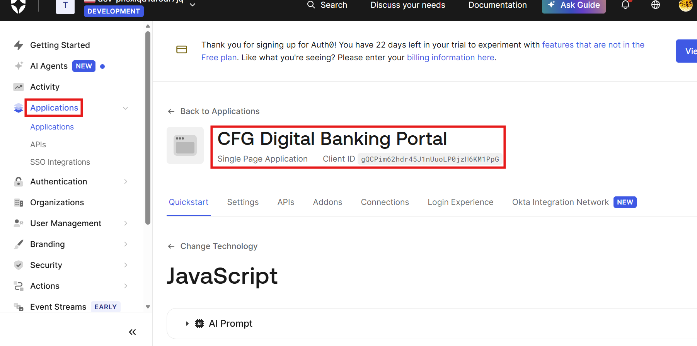
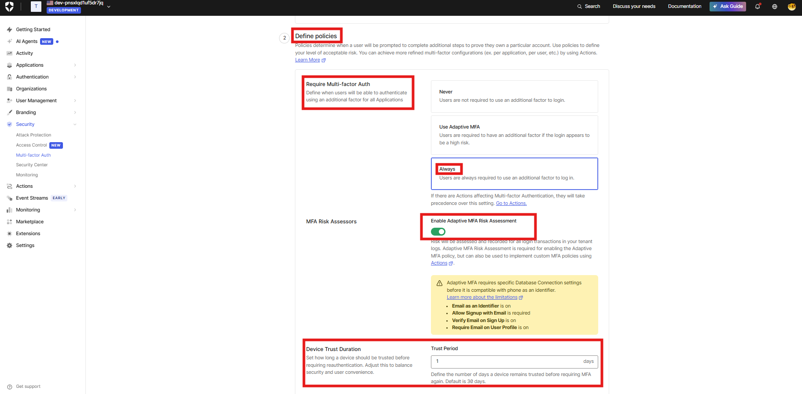
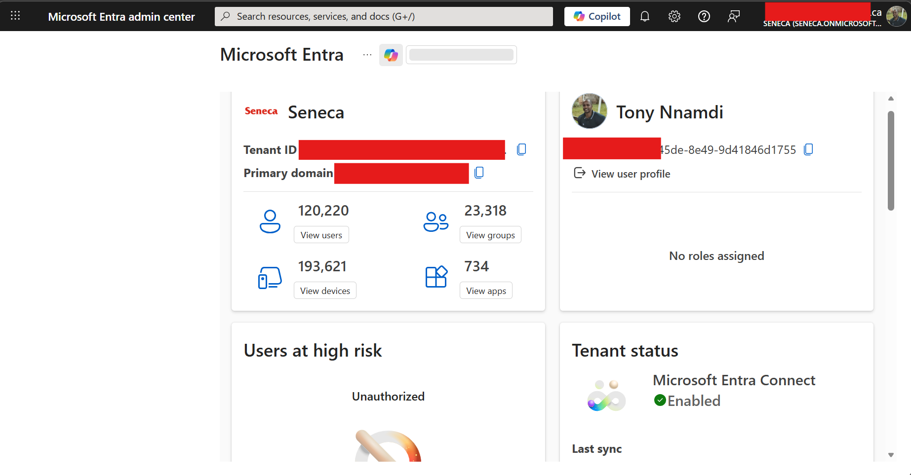

# Crestview Financial Group — Zero Trust Architecture IAM Simulation

> **SEC815 Capstone Project — Seneca College**  
> Designing ZTA Solutions for a Canadian Financial Institution

---

## Overview

This repository documents the design and partial simulation of a Zero Trust Architecture (ZTA) Identity and Access Management (IAM) solution for **Crestview Financial Group (CFG)** — a fictional mid-sized Toronto-based financial services firm offering retail banking, wealth management, and digital banking services.

The project aligns four enterprise IAM tools to the **CISA Zero Trust Maturity Model's five pillars**, anchored to a defined DAAS protect surface, and demonstrates live configuration of identity controls using Auth0 (Okta) and Microsoft Entra ID.

This work was completed as part of **SEC815 — Incident Response** at Seneca College, with the broader goal of building a portfolio-grade IAM artefact relevant to cybersecurity roles in the Canadian financial services sector.

---

## The Protect Surface — DAAS Framework

Zero Trust does not attempt to secure everything equally. Instead, it identifies the smallest, most defensible grouping of critical assets — the **protect surface** — organized by the DAAS framework.

| Category | CFG Assets | Regulatory Consequence if Breached |
|---|---|---|
| **Data** | Customer PII, KYC/AML records, transaction ledger, OSFI/FINTRAC filings | PIPEDA notification + FINTRAC sanctions |
| **Applications** | Digital banking portal, core banking system, wealth management platform | OSFI 24-hour incident reporting obligation |
| **Assets** | On-premises servers, HSMs, ATM network, hybrid workforce endpoints | HSM compromise halts all verified transactions |
| **Services** | Microsoft Entra ID, SWIFT payment network, core banking API gateway | Entra ID compromise cascades to all downstream systems |

---

## ZTA Solution Stack

| ZTA Pillar | Tool | Key Controls |
|---|---|---|
| **Identity** | Microsoft Entra ID + Okta | Adaptive MFA, Conditional Access, PIM, SSO |
| **Devices** | Microsoft Entra ID | Device compliance policies, guest access governance |
| **Applications & Workloads** | Okta + SailPoint IdentityNow | Per-session authorization, access governance, SSO |
| **Data** | SailPoint IdentityNow | Least-privilege, SoD enforcement, access certifications |
| **Networks** | CyberArk PAM | Credential vaulting, session isolation, JIT access |

---

## Live Demo — Auth0 (Okta)

An Auth0 tenant was configured to simulate CFG's digital banking portal identity controls, demonstrating the **Identity pillar** in a live environment.

### CFG Digital Banking Portal — Registered Application

Auth0 was configured with a Single Page Application representing CFG's customer-facing digital banking portal. This simulates how Okta Workforce Identity would be deployed to enforce authentication policies at the application layer.



### MFA Policy — Always Enforced

MFA policy was set to **Always** — every login to the CFG banking portal requires an additional authentication factor regardless of device, location, or prior session. This directly implements ZTA's principle of per-session verification with no implicit trust.



### Adaptive MFA Risk Assessment — Enabled

Adaptive MFA Risk Assessment was enabled, meaning every login transaction is risk-scored and recorded in audit logs. This supports anomaly detection and aligns with OSFI B-13's requirement for continuous monitoring of access events.


### Attack Protection — Active Controls

Suspicious IP Throttling and Brute-force Protection are enabled, protecting CFG's banking portal against credential stuffing and automated attack campaigns — the primary external threat vector against the Applications layer of CFG's protect surface.


---

## Live Demo — Microsoft Entra ID

Microsoft Entra ID was accessed via a real enterprise tenant to demonstrate the Identity and Devices pillars in a production-scale environment.

### Enterprise Tenant Dashboard

The Seneca College Entra ID tenant (120,000+ users, 193,000+ devices, 734 applications, Entra Connect enabled) was used to demonstrate what a real hybrid identity environment looks like at scale — directly analogous to CFG's hybrid on-premises + Azure architecture.



### User Identity Object

A real user identity object was inspected, demonstrating how CFG employee identities would be represented in Entra ID — including group memberships, assigned licenses, and device associations.


### Device Compliance View

The device management layer was accessed, demonstrating how Entra ID enforces device compliance as a condition of access — a core control in the Devices pillar of CFG's ZTA architecture.


> **Note:** Access was performed at student permission level. Full Conditional Access policy configuration, Identity Protection risk detection, and Privileged Identity Management would be performed at the administrator level in a CFG production deployment. See `/entra-id/conditional-access-policy.json` for a simulated policy configuration.

---

## Simulated Configurations

SailPoint IdentityNow and CyberArk PAM do not offer accessible free tiers for hands-on demonstration. The following simulated configuration files document how each tool would be configured in a CFG ZTA deployment, written to reflect real enterprise configuration logic.

| Tool | File | What it represents |
|---|---|---|
| SailPoint | `/sailpoint/role-definition.yaml` | Least-privilege role for a CFG bank teller |
| SailPoint | `/sailpoint/access-certification.yaml` | Quarterly access review campaign config |
| CyberArk | `/cyberark/safe-policy.yaml` | SWIFT operator credential vault policy |
| CyberArk | `/cyberark/jit-access-policy.yaml` | Just-in-time access workflow for DB admins |
| Entra ID | `/entra-id/conditional-access-policy.json` | Simulated Conditional Access policy |
| Okta | `/okta/mfa-policy.json` | Documented MFA policy configuration |

---

## Regulatory Alignment

| Framework | Obligation | ZTA Control |
|---|---|---|
| **OSFI B-13** | Technology & cyber risk management framework — eff. Jan 1, 2024 | Entra ID + Okta governance + CyberArk audit trails |
| **OSFI E-21** | Operational resilience — full adherence Sept 1, 2026 | Microsegmentation + JIT access limits blast radius |
| **PIPEDA** | Breach notification for significant harm to individuals | SailPoint data-level access governance |
| **FINTRAC** | AML record integrity and auditability | CyberArk privileged session recording |
| **PCI-DSS** | Payment card data protection | CyberArk credential vaulting for payment systems |

---

## Repository Structure

```
crestview-zta-iam/
├── README.md
├── architecture/
│   └── zta-daas-diagram.png        # DAAS protect surface diagram
├── docs/
│   ├── threat-model.md             # CFG threat landscape analysis
│   └── regulatory-mapping.md       # Detailed regulatory control mapping
├── okta/
│   ├── README.md
│   ├── mfa-policy.json             # Simulated MFA policy config
│   └── screenshots/                # Live Auth0 demo screenshots
├── sailpoint/
│   ├── README.md
│   ├── role-definition.yaml        # Bank teller least-privilege role
│   └── access-certification.yaml   # Quarterly review campaign
├── cyberark/
│   ├── README.md
│   ├── safe-policy.yaml            # SWIFT operator vault policy
│   └── jit-access-policy.yaml      # JIT access for DB administrators
└── entra-id/
    ├── README.md
    ├── conditional-access-policy.json  # Simulated CA policy
    └── screenshots/                    # Live Entra ID demo screenshots
```

---

## Key References

- Canadian Centre for Cyber Security. (2023). *Zero trust security model* (ITSAP.10.008). https://www.cyber.gc.ca
- CISA. (2023). *Zero trust maturity model version 2.0*. https://www.cisa.gov
- NIST. (2020). *Zero trust architecture* (SP 800-207). https://doi.org/10.6028/NIST.SP.800-207
- OSFI. (2024). *Guideline B-13: Technology and cyber risk management*. https://www.osfi-bsif.gc.ca
- Kindervag, J. (2010). *Build security into your network's DNA*. Forrester Research.

---

## Author

**Tony Nnamdi** | Seneca College — Cloud Administration & Architecture  
Cybersecurity Post-Graduate | Centennial College  
GitHub: [@tnnamdi](https://github.com/tnnamdi)  
Focus: IAM · GRC · Security Analysis · Zero Trust Architecture
